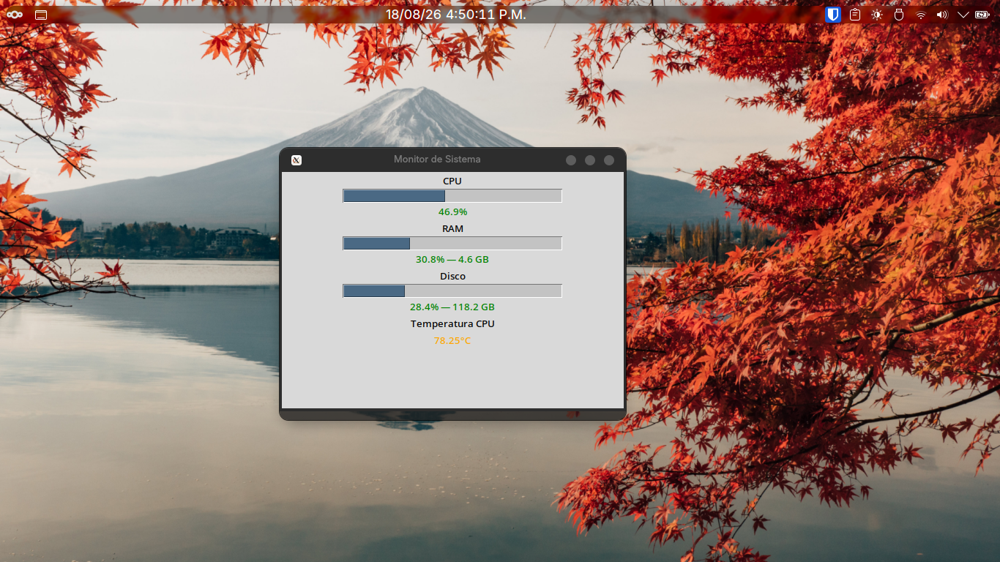

# Monitor de Sistema en Tiempo Real

Monitor de recursos del sistema desarrollado en Python con interfaz gráfica. Muestra el uso de CPU, RAM y disco con barras de progreso y colores que cambian según el nivel de uso.

## Descripción

Aplicación de escritorio que permite visualizar en tiempo real el estado de los recursos del sistema. Cada métrica se actualiza automáticamente cada segundo y cambia de color según el nivel de uso para facilitar la lectura rápida del estado del equipo.



## Funcionalidades

- **CPU**: porcentaje de uso en tiempo real
- **RAM**: porcentaje y GB usados / disponibles
- **Disco**: porcentaje y GB usados / disponibles
- Actualización automática cada segundo
- Colores indicadores:
  - Verde: uso normal (0–60%)
  - Amarillo: uso moderado (60–80%)
  - Rojo: uso elevado (80–100%)
- Barras de progreso visuales para cada recurso

## Tecnologías

- Python 3
- Tkinter (interfaz gráfica)
- psutil (lectura de recursos del sistema)
- POO — Programación Orientada a Objetos (clases)

## Requisitos

- Python 3.x instalado
- Instalar dependencia:

```bash
pip install psutil
```

## Cómo ejecutar

```bash
python monitor.py
```

## Limitaciones conocidas

- **Sin manejo de errores en las llamadas a psutil**: si `psutil.sensors_temperatures()` u otra función falla (por ejemplo, en Windows/Mac donde algunos sensores no están disponibles, o por permisos), la excepción no se captura y el ciclo de actualización se detiene sin avisar al usuario.
- **Llamada bloqueante en el hilo de la GUI**: `psutil.cpu_percent(interval=1)` bloquea la ventana durante 1 segundo en cada actualización, por lo que la interfaz no responde durante ese lapso.
- **Sin manejo del cierre de ventana**: no se captura el evento `WM_DELETE_WINDOW`, por lo que cerrar la ventana justo antes de un ciclo de actualización puede generar un traceback en consola.
- **Valores hardcodeados**:
  - La lista de sensores de temperatura (`k10temp`, `coretemp`) no cubre todos los chips posibles (por ejemplo `zenpower`, `acpitz`), por lo que en algunas máquinas la temperatura puede mostrarse siempre como "N/D".
  - La ruta de disco monitoreada (`/`) no es válida en Windows.
- **`elegir_color` reutilizada para dos escalas distintas**: la misma función y los mismos umbrales (60/85) se usan tanto para porcentajes de uso (0-100%) como para temperatura en °C, lo cual es una coincidencia funcional y no un diseño explícito.

## Nota

Proyecto educativo desarrollado como primer acercamiento al uso de clases y Programación Orientada a Objetos en Python.
